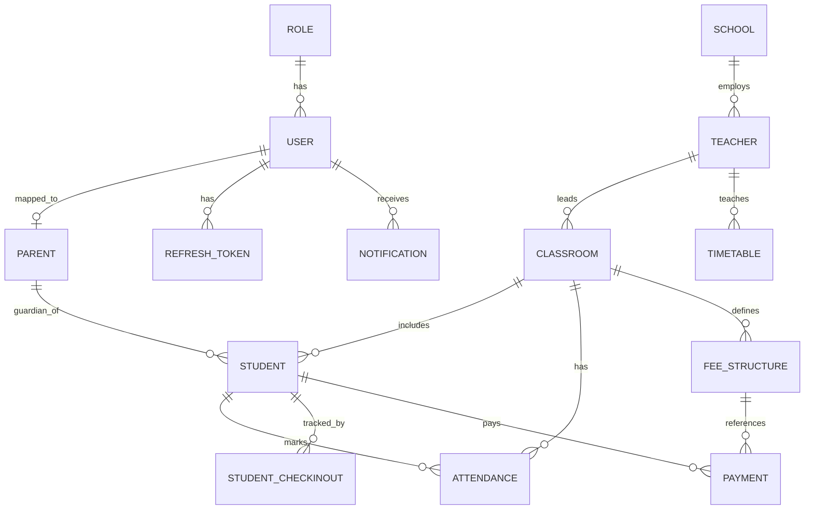

# Preschool Management System API (.NET 8)

Production-style ASP.NET Core Web API built with Clean Architecture layers:

- `PreschoolManagement.API`
- `PreschoolManagement.Application`
- `PreschoolManagement.Domain`
- `PreschoolManagement.Infrastructure`

## 1) Solution Structure

```text
Project-Pre/
  PreschoolManagement.slnx
  PreschoolManagement.API/
    Controllers/
    Middleware/
    Program.cs
    appsettings.json
  PreschoolManagement.Application/
    Common/
    DTOs/
    Interfaces/
    Mappings/
    DependencyInjection.cs
  PreschoolManagement.Domain/
    Common/
    Enums/
    Entities/
  PreschoolManagement.Infrastructure/
    DependencyInjection/
    Identity/
    Persistence/
    Repositories/
    Services/
```

## 2) Implemented Architecture Patterns

- Clean Architecture (API, Application, Domain, Infrastructure)
- Repository Pattern (`IGenericRepository<T>`, `GenericRepository<T>`)
- Unit of Work (`IUnitOfWork`, `UnitOfWork`)
- Dependency Injection via extensions
- JWT Authentication + RBAC
- Global Exception Middleware
- Generic API Response Wrapper
- Soft Delete (`IsDeleted`) with global query filter
- Audit fields (`CreatedBy`, `CreatedDate`, `UpdatedBy`, `UpdatedDate`)
- Pagination, Sorting, Filtering in generic repository
- AutoMapper profile-based DTO mapping
- Serilog logging (console + rolling files)
- Swagger/OpenAPI with JWT bearer support
- Scalar API reference UI (`/scalar`) backed by OpenAPI JSON

## 3) Domain Modules Covered

- Authentication & User Management
- Preschool (School) Management
- Teacher Management
- Parent Management
- Student Management
- Classroom Management
- Attendance Management
- Check-In / Check-Out Management
- Timetable Management
- Payment & Fee Management
- Inventory Management
- Notice Board Management
- Notification Management
- Reporting + Dashboard APIs

## 4) ER Diagram (Mermaid)



## 5) SQL Server Design Notes

- Primary key for all tables: `uniqueidentifier` (`Id`)
- Soft delete and audit columns included on all entities
- Unique indexes:
  - `Users.Email`
  - `Teachers.EmployeeCode`
  - `Students.AdmissionNumber`
  - `Roles.RoleName`
  - `Payments.TransactionReference`
- Referential constraints are configured in Fluent API with restricted or safe delete behaviors

A starter SQL file is available at `database/initial-schema.sql`.

## 6) API Endpoint Pattern

Each module has standard CRUD endpoints:

- `GET /api/{module}`
- `GET /api/{module}/{id}`
- `POST /api/{module}`
- `PUT /api/{module}/{id}`
- `DELETE /api/{module}/{id}` (soft delete)

Additional APIs:

- Auth: `/api/auth/*`
- Reports: `/api/reports/*`
- Dashboard: `/api/dashboard/summary`

## 7) Sample Auth Requests

### Register

```http
POST /api/auth/register
Content-Type: application/json

{
  "firstName": "Ava",
  "lastName": "Parent",
  "email": "ava.parent@example.com",
  "phoneNumber": "1234567890",
  "password": "StrongPass@123",
  "roleId": "00000000-0000-0000-0000-000000000000"
}
```

### Login

```http
POST /api/auth/login
Content-Type: application/json

{
  "email": "superadmin@preschool.local",
  "password": "Admin@123"
}
```

## 8) Migrations (Code-First)

When SQL Server provider package is available in your feed, run:

```bash
dotnet tool install --global dotnet-ef
dotnet ef migrations add InitialCreate -p PreschoolManagement.Infrastructure -s PreschoolManagement.API
dotnet ef database update -p PreschoolManagement.Infrastructure -s PreschoolManagement.API
```

## 9) Run & Deploy

### Local run

```bash
dotnet restore PreschoolManagement.slnx
dotnet build PreschoolManagement.slnx
dotnet run --project PreschoolManagement.API
```

API docs URLs after startup:

- Swagger UI: `/swagger`
- Scalar UI: `/scalar`

### Deployment checklist

- Update `ConnectionStrings:DefaultConnection`
- Replace `Jwt:Key` with a secure secret
- Set environment-specific appsettings
- Enable HTTPS and reverse proxy headers
- Configure centralized log sink for Serilog
- Apply migrations in CI/CD before app start

## 10) Important Environment Note

Your current package source mapping blocks these packages at restore-time:

- `Microsoft.EntityFrameworkCore.SqlServer`
- `Microsoft.EntityFrameworkCore.Design`
- `FluentValidation*`

The delivered code is compile-ready and production-structured. To enable full SQL Server provider migrations and FluentValidation package wiring, allow those package IDs in your NuGet package source mapping policy and then run the migration commands above.
